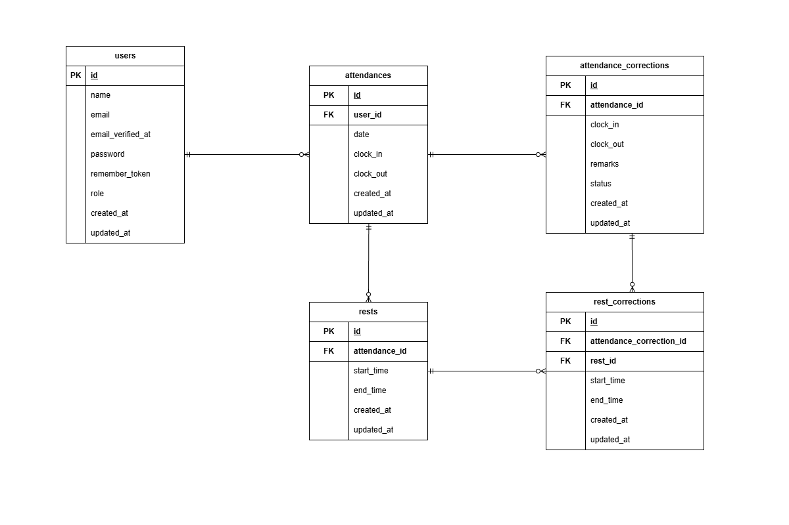

# COACHTECH模擬案件\_勤怠管理システム

## 環境構築（Docker）

### 1.プロジェクトのクローンとコンテナ起動

```
git clone git@github.com:nom-wako/attendance-app.git
cd attendance-app
docker-compose up -d --build
```

> MacのM1・M2チップ等のApple Silicon搭載PCでMyQLのエラー（`no matching manifest for linux/arm64/v8...`）が発生する場合は、docker-compose.ymlのmysqlサービス内に`platform: linux/x86_64`を追記して再度ビルドしてください。

### 2.Laravel環境のセットアップ

```
docker-compose exec php bash
composer install
```

### 3.環境変数（.env）の設定

環境変数ファイルを作成
`cp .env.example .env`
.envファイルを開き、データベース接続情報を以下のように変更してください。

```
DB_CONNECTION=mysql
DB_HOST=mysql
DB_PORT=3306
DB_DATABASE=laravel_db
DB_USERNAME=laravel_user
DB_PASSWORD=laravel_pass

# メール認証（Mailhog）の設定
MAIL_MAILER=smtp
MAIL_HOST=mailhog
MAIL_PORT=1025
MAIL_USERNAME=null
MAIL_PASSWORD=null
MAIL_ENCRYPTION=null
MAIL_FROM_ADDRESS="noreply@example.com"
```

### 4.アプリケーションキー生成とデータベース構築

コンテナ内で以下のコマンドを順に実行してください。

```
# アプリケーションキーの生成
php artisan key:generate

# マイグレーションの実行（テーブル作成）
php artisan migrate

# シーディングの実行（テストユーザー・初期データの投入）
php artisan db:seed
```

## メール認証（Mailhog）について

本システムでは、ユーザーの新規登録時にメール認証を行っています。
送信された認証メールは、ローカル環境のMailhogにて確認できます。

- Mailhog UI：`http://localhost:8025`（※ポート番号はご自身の環境に合わせてください）

## テスト実行手順

本プロジェクトではPHPUnitを使用して品質管理を行っています。
テスト実行用に専用のデータベースを作成してテストを行います。

```
# 1. テスト用データベースの作成
docker-compose exec mysql bash
mysql -u root -p
# パスワードを求められたら root と入力
create database test_database;
exit;
exit;

# 2. テストの実行
docker-compose exec php bash
php artisan migrate:fresh --env=testing
php artisan test
```

## テストアカウント

### 【管理者ユーザー】

- name: 管理者テスト
- email: admin@example.com
- password: password

### 【一般ユーザー】

- name: 一般テスト
- email: user@example.com
- password: password

## 使用技術（実行環境）

- PHP 8.1.34
- Laravel 8.83.29
- MySQL 8.0.26
- Mailhog

## ER図



## URL

- 開発環境：http://localhost
- phpMyAdmin：http://localhost:8080
- Mailhog：http://localhost:8025
